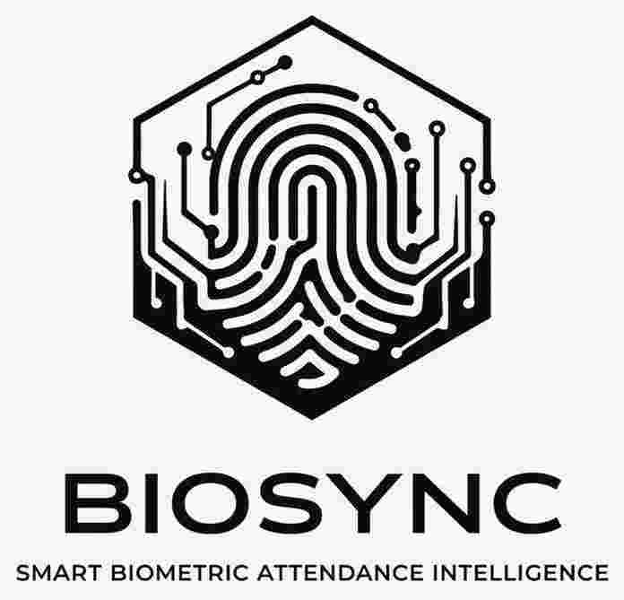
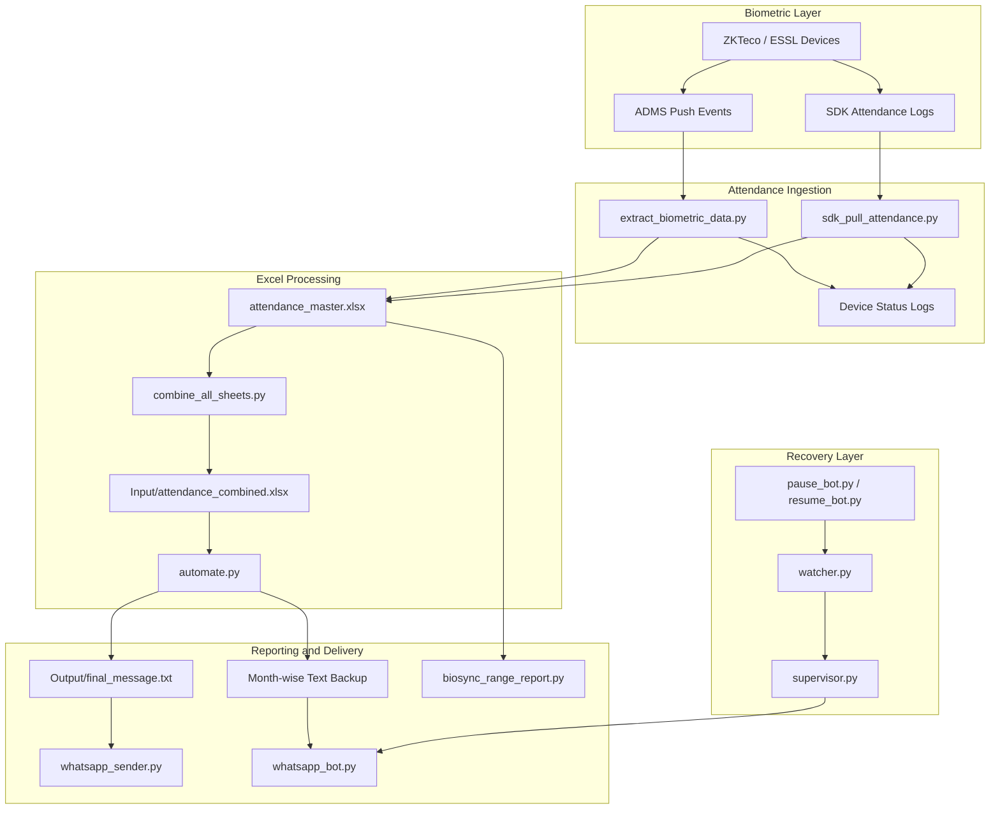
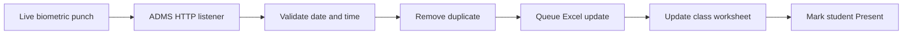
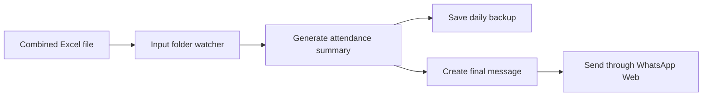
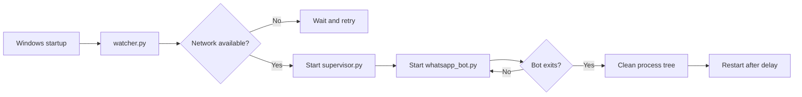

<div align="center">



# BIOSYNC

### Smart Biometric Attendance & Analytical Platform

**A Windows-based attendance automation system that connects biometric devices, Excel reporting, analytics, WhatsApp delivery, and self-recovery services.**

<p>
  
  
  
  
  
</p>

[Overview](#overview) •
[Features](#implemented-features) •
[Architecture](#system-architecture) •
[Setup](#installation-and-setup) •
[Usage](#running-biosync) •
[Security](#security-and-deployment-notes)

</div>

---

## Overview

**BIOSYNC** automates the complete attendance workflow for an educational institution.

It receives punch records from biometric devices, updates class-wise Excel sheets, creates consolidated attendance files, calculates present and absent counts, stores daily backups, generates analytical reports, and distributes attendance information through WhatsApp.

The repository supports two biometric ingestion methods:

1. **Real-time ADMS receiver** — devices push live punch events to configured HTTP ports.
2. **ZKTeco SDK pull** — BIOSYNC connects directly to selected devices and downloads attendance logs for the current day or a configured past date.

The system is designed around a local Windows deployment and uses Excel files as its attendance data store.

```text
Biometric Devices
        ↓
Live ADMS Receiver / SDK Pull
        ↓
Class-wise Attendance Workbook
        ↓
Combined Attendance File
        ↓
Attendance Processing
        ↓
Daily Backup + Reports
        ↓
WhatsApp Delivery and Query Bot
```

---

## Why BIOSYNC?

Managing attendance from many biometric devices manually creates several operational problems:

- Attendance must be collected separately from multiple devices.
- Device downtime may go unnoticed.
- Raw punch records require cleaning and class-wise organization.
- Staff need daily absentee summaries quickly.
- Historical attendance reports take time to prepare.
- Automation may stop after network, browser, or system failures.

BIOSYNC brings these tasks into one automated workflow with device monitoring, Excel processing, scheduled execution, local backups, WhatsApp reporting, and process recovery.

---

## Implemented Features

### Biometric Data Collection

- Receives live ADMS punch events through device-specific ports
- Immediately acknowledges device requests to avoid blocking the terminal
- Accepts only recent live punches within a configurable time window
- Ignores buffered and duplicate punch events
- Uses a thread-safe queue for Excel updates
- Supports direct SDK-based attendance retrieval through `zk.ZK`
- Supports selected-device execution for targeted reruns
- Supports current-date and historical-date SDK pulls
- Provides an optional device-log clearing mode

### Excel Attendance Processing

- Maintains separate worksheets for classes and sections
- Matches biometric user IDs against employee or student codes
- Writes the latest punch time
- Maintains sorted punch history
- Marks matched users as `Present`
- Generates class-level present, absent, and attendance-percentage summaries
- Combines all class sheets into a consolidated attendance workbook
- Compresses updated Excel workbooks after SDK processing

### Device Health Monitoring

- Tracks the latest communication time for configured devices
- Classifies devices as `ONLINE` or `OFFLINE`
- Rewrites a fixed-size device-status log periodically
- Records successful, offline, empty-log, and failed SDK devices
- Prints a ready-to-copy rerun list for failed devices

### Daily Attendance Reports

- Reads CSV, XLS, and XLSX attendance input files
- Keeps only the latest numbered version of duplicate files
- Detects department and class blocks
- Calculates present and absent totals
- Lists absentee names
- Flags a class as potentially offline when every student is absent
- Generates an institution-wide attendance summary
- Saves the final WhatsApp-ready report locally
- Maintains month-wise daily text backups

### WhatsApp Automation

BIOSYNC contains two WhatsApp workflows:

#### Scheduled Report Sender

- Reads the generated `final_message.txt`
- Reuses a dedicated Chrome profile
- Selects configured chats or contacts
- Sends the report through WhatsApp Web
- Removes the temporary message after delivery

#### Interactive Attendance Bot

- Reads attendance questions from a configured WhatsApp chat
- Supports class-level, department-level, and all-department requests
- Supports daily, weekly, and monthly report periods
- Understands explicit dates, `today`, and `yesterday`
- Searches month-wise local backup folders
- Uses a worker queue for concurrent requests
- Caches recently accessed backup files
- Splits oversized reports into two WhatsApp text messages
- Keeps the Windows machine awake while the bot is active
- Recovers from stale Chrome profile locks
- Restarts the browser session every two hours
- Detects network loss and reconnects after service returns

Example bot requests:

```text
report for III AIML today
report for I CSE A on 24-03-2026
weekly report for II IT B
monthly report for all departments
report for AIML yesterday
help
```

### Analytical Range Reports

`biosync_range_report.py` generates Excel reports across a selected date range.

Supported report modes:

| Mode | Configuration |
|---|---|
| Individual student | Set `EMP_CODE` and `CLASS_NAME` |
| Complete class | Set `CLASS_NAME` and leave `EMP_CODE` empty |
| Department comparison | Set `DEPARTMENT` |

Generated analytics can include:

- Date-wise student attendance
- Working days, present days, and absent days
- Individual attendance percentage
- Class-wise student percentages
- Class average
- Department comparison
- Pie charts
- Bar charts
- BIOSYNC-branded report footer

---

## System Architecture



---

## Main Workflows

### 1. Live Attendance Workflow



The live engine currently uses:

```text
Live-punch window : 120 seconds
Device timeout    : 30 seconds
Status refresh    : 10 seconds
```

These values can be changed inside `extract_biometric_data.py`.

### 2. Scheduled Daily Workflow

The default PowerShell controller is configured to:

```text
08:30  Start the live attendance extractor
09:30  Stop the extractor
09:33  Combine all class sheets
```

The schedule is configurable in `run_biosync.ps1`.

### 3. Report Delivery Workflow



### 4. Recovery Workflow



---

## Key Repository Files

| File | Responsibility |
|---|---|
| `extract_biometric_data.py` | Real-time ADMS listener, live-punch filtering, duplicate control, Excel updates, and device monitoring |
| `sdk_pull_attendance.py` | Direct SDK-based log retrieval, historical pulls, workbook updates, and execution summaries |
| `combine_all_sheets.py` | Combines class worksheets into one institution-level input file |
| `automate.py` | Processes attendance files and creates daily summaries and backups |
| `watch_and_send.py` | Watches the input folder and triggers report generation and WhatsApp sending |
| `whatsapp_sender.py` | Sends the generated daily report to configured WhatsApp contacts |
| `whatsapp_bot.py` | Interactive daily, weekly, and monthly attendance query bot |
| `biosync_range_report.py` | Generates student, class, and department analytical Excel reports |
| `run_biosync.ps1` | Runs the scheduled daily extraction and workbook-combination cycle |
| `watcher.py` | Network-aware process watcher |
| `supervisor.py` | Restarts the WhatsApp bot after an exit or crash |
| `pause_bot.py` | Pauses the background automation |
| `resume_bot.py` | Resumes the watcher and supervisor chain |
| `start_bot.bat` | Starts the recovery watcher in the background |
| `start_bot_startup.bat` | Windows-startup launcher with network checks |
| `attendance_master.xlsx` | Main class-wise attendance workbook |
| `attendance_master_past.xlsx` | Workbook used for historical SDK pulls |
| `MIGRATION MANUAL.docx` | Deployment and migration reference |
| `INSTALLATION AND MIGRATION.pptx` | Installation and migration presentation |

---

## Technology Stack

| Area | Technology |
|---|---|
| Language | Python |
| Operating system | Windows |
| Biometric communication | ZKTeco/ESSL ADMS and ZK SDK |
| Spreadsheet processing | OpenPyXL and Pandas |
| Browser automation | Selenium and ChromeDriver |
| Messaging | WhatsApp Web |
| Date parsing | python-dateutil |
| Process monitoring | psutil |
| Scheduling | PowerShell and Windows startup scripts |
| Local storage | Excel, text files, and log files |

---

## Installation and Setup

### Prerequisites

- Windows 10 or Windows 11
- Python 3.11 or a compatible version
- Google Chrome
- A ChromeDriver version compatible with Chrome
- ZKTeco/ESSL biometric devices reachable from the BIOSYNC computer
- A prepared attendance workbook
- A WhatsApp account logged into the dedicated Chrome profile

### 1. Clone the Repository

```bash
git clone https://github.com/Nithish-code17/BIOSYNC-Smart-Attendance-and-Analytical-Platform.git
cd BIOSYNC-Smart-Attendance-and-Analytical-Platform
```

### 2. Create a Virtual Environment

```powershell
python -m venv venv
.\venv\Scripts\Activate.ps1
```

### 3. Install Python Dependencies

The repository currently does not include a `requirements.txt` file. Install the packages used by the source code:

```bash
pip install pandas openpyxl selenium python-dateutil pyperclip psutil pyzk
```

### 4. Prepare the Runtime Folders

The scripts use `C:\AttendanceAutomation` as the default base directory.

```text
C:\AttendanceAutomation\
├── Input\
├── Output\
├── Backup\
├── BackupExcel\
├── RangeReports\
├── attendance_master.xlsx
├── attendance_master_past.xlsx
├── logo.jpg
└── Python and Windows automation scripts
```

Create the required folders before running the pipeline.

### 5. Prepare the Attendance Workbook

The main scripts expect the following worksheet columns:

| Column | Data |
|---|---|
| B | Employee or student code |
| D | Name |
| E | Latest punch |
| H | Punch history |
| J | Attendance status |

Each class or section must have a corresponding worksheet name that matches the device configuration.

### 6. Configure the Device Connections

#### Real-Time ADMS Mode

Edit `PORT_DEVICE_MAP` in:

```text
extract_biometric_data.py
```

Map each receiving port to its correct worksheet.

#### SDK Pull Mode

Edit these settings in:

```text
sdk_pull_attendance.py
```

```python
DEVICES = [...]
TARGET_DEVICES = [...]
AUTO_CLEAR_LOGS = False
FETCH_DATE = None
```

Keep `AUTO_CLEAR_LOGS` disabled until attendance retrieval has been tested and verified.

### 7. Configure WhatsApp

Update the following values in `whatsapp_sender.py` and `whatsapp_bot.py`:

- ChromeDriver path
- Chrome user-data directory
- WhatsApp chat or contact name
- Attendance backup folder
- Log file locations

Run the bot once in a visible Chrome window and complete the WhatsApp Web login.

---

## Running BIOSYNC

### Run the Scheduled Daily Cycle

```powershell
Set-ExecutionPolicy Bypass -Scope Process
.\run_biosync.ps1
```

### Run the Live Attendance Receiver Manually

```bash
python extract_biometric_data.py
```

### Pull Logs Directly from Devices

```bash
python sdk_pull_attendance.py
```

### Combine All Attendance Sheets

```bash
python combine_all_sheets.py
```

### Process an Attendance Input File

Place an Excel or CSV file inside `Input`, then run:

```bash
python automate.py
```

### Start the Folder-to-WhatsApp Pipeline

```bash
python watch_and_send.py
```

### Start the Interactive WhatsApp Bot

```bash
python whatsapp_bot.py
```

### Start the Recovery Chain

```bash
start_bot.bat
```

or:

```bash
python watcher.py
```

### Pause and Resume

```bash
python pause_bot.py
python resume_bot.py
```

### Generate an Analytical Range Report

Configure the target and date range inside `biosync_range_report.py`, then run:

```bash
python biosync_range_report.py
```

The range-report script expects daily Excel snapshots named:

```text
DD-MM-YYYY.xlsx
```

inside monthly subfolders under `BackupExcel`.

---

## Generated Outputs

| Output | Default location |
|---|---|
| Main attendance workbook | `attendance_master.xlsx` |
| Consolidated workbook | `Input/attendance_combined.xlsx` |
| WhatsApp-ready report | `Output/final_message.txt` |
| Daily text backups | `Backup/<Month-Year>/<DD-MM-YYYY>.txt` |
| Range reports | `RangeReports/*.xlsx` |
| Live device status | `device_status.log` |
| SDK device status | `sdk_device_status.log` |
| Automation log | `automation.log` |
| WhatsApp bot log | `whatsapp_bot.log` |
| Watcher log | `watcher.log` |
| Supervisor log | `supervisor.log` |
| Pause/resume history | `pause_resume.log` |

---

## Reliability Design

BIOSYNC uses several layers to keep the automation running:

- Immediate HTTP acknowledgement for biometric devices
- Thread-safe attendance queue
- Excel file locking
- Device connectivity checks
- File stability and MD5 checks
- Retry logic
- Saved Chrome profiles
- ChromeDriver process cleanup
- Stale profile-lock removal
- Scheduled browser restarts
- Windows keep-awake calls
- Network loss detection
- PID and lock files
- Watcher and supervisor processes
- Manual pause and resume controls

---

## Current Limitations

- Paths, device mappings, and WhatsApp chat names are hardcoded.
- The deployment is Windows-specific.
- Excel files are used as the primary data store.
- There is no committed database, REST API, or web dashboard.
- Google Drive synchronization described in the previous README is not implemented in the committed Python source.
- Admin, staff, and parent dashboards described in planning documents are not present as runnable UI code.
- The range-report script expects Excel backups, but an automatic `BackupExcel` snapshot service is not included.
- Selenium selectors may require updates when WhatsApp Web changes.
- There are no automated tests or continuous-integration workflows.
- A dependency file is not currently included.
- Multiple scripts contain environment-specific absolute paths.

---

## Security and Deployment Notes

This repository currently contains operational artifacts such as:

- Internal device-network configuration
- Attendance workbooks
- Application logs
- PID and lock files
- Environment-specific Windows paths

Before using the repository publicly or deploying it elsewhere:

1. Remove or anonymize student and employee attendance data.
2. Move device addresses and chat names into environment variables or a private configuration file.
3. Add `.gitignore` rules for workbooks, logs, PID files, backups, Chrome profiles, and generated reports.
4. Do not commit WhatsApp browser profiles or authentication data.
5. Restrict biometric devices and ADMS ports to a trusted internal network.
6. Back up the workbook before enabling log clearing.
7. Review the current license attribution before redistributing the project.

Example `.gitignore` entries:

```gitignore
venv/
__pycache__/
*.pyc
*.log
*.pid
*.lock
*.xlsx
Backup/
BackupExcel/
Input/
Output/
RangeReports/
pause.flag
control.txt
```

---

## Recommended Improvements

- [ ] Add a central YAML or `.env` configuration
- [ ] Add `requirements.txt`
- [ ] Add a secure `.gitignore`
- [ ] Remove generated logs and production workbooks from version control
- [ ] Replace Excel locking with a transactional database
- [ ] Add an administration dashboard
- [ ] Add staff and parent portals
- [ ] Add secure Google Drive or object-storage backups
- [ ] Add role-based authentication
- [ ] Add automated Excel snapshot creation
- [ ] Add unit and integration tests
- [ ] Add health-check and metrics endpoints
- [ ] Package the automation as a Windows service
- [ ] Add encrypted configuration for device and messaging credentials

---

## License

This repository includes the **Apache License 2.0**.

Review and retain the attribution contained in the existing `LICENSE` file when redistributing or modifying the project.

---

## Maintainer

<div align="center">

### Nithish Sarwin

Artificial Intelligence & Machine Learning Student  
Automation and Backend Developer

[GitHub](https://github.com/Nithish-code17) ·
[LinkedIn](https://linkedin.com/in/nithishsarwin) ·
[Email](mailto:mnithishsarwin@gmail.com)

</div>

---

<div align="center">

**From biometric punch to actionable attendance insight—automatically.**

</div>
